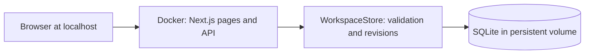

# Architecture and code map

[Documentation home](../README.md)

Pathways Local is one Next.js application containing the browser interface and
server API. One deployment serves one local workspace. SQLite is embedded in the
Node process; there is no database service, authentication provider, cloud SDK,
worker, or queue.

## Local identity and request boundary

`local-access.ts` defines one stable owner identity. Users do not sign in, and
client requests cannot choose an identity or edit membership. The old session and
members routes are absent. `/login` redirects old bookmarks to `/`.

Compose publishes only on `127.0.0.1`. The API validates the actual Host header
against `APP_BASE_URL` and rejects cross-site fetches and foreign Origins. Writes
also require the exact Origin and `X-Pathways-Client: 1`. Forwarded host headers
cannot override these checks. This is a local desktop service, not a multi-user
server; local programs can access it. Never expose it publicly.

The inherited membership model remains inside `WorkspaceStore` to preserve domain
validation, snapshot compatibility, and regression coverage. The runtime always
uses the local owner, and no account-management UI or endpoint is exposed.

## Source map

| Area | Source |
| --- | --- |
| Main screen and dialogs | `components/roadmap/roadmap-app.tsx` and adjacent files |
| Automatic saves and tab conflicts | `hooks/use-shared-workspace.ts` |
| Task/dependency/decision rules | `lib/roadmap.ts` |
| Projects, teams, imports, and templates | `lib/projects.ts` |
| Three-way merging and snapshots | `lib/shared.ts` |
| HTTP validation and errors | `lib/server-workspace.ts`, `app/api/workspace/route.ts` |
| Local identity and origin/host checks | `lib/local-access.ts` |
| Domain write rules and revisions | `lib/workspace-store.ts` |
| Durable SQLite adapter | `lib/sqlite-repository.ts` |
| Diagram rendering | `components/roadmap/roadmap-canvas.tsx` |
| Automatic geometry and connector routing | `lib/roadmap-layout.ts`, `lib/connector-routing.ts` |
| Defaults and styling | `lib/sample-roadmap.ts`, `app/globals.css`, `components/ui/` |
| Container and volume | `Dockerfile`, `compose.yaml` |

## A save from browser to disk

1. A domain helper changes the draft; local schema validation gives immediate feedback.
2. The save hook sends the visible workspace and last revision after a 450 ms delay.
3. The API checks request origin/host, request size, headers, and JSON structure.
4. `WorkspaceStore` validates task rules and compares the submitted revision.
5. `SqliteRepository` atomically updates the entire JSON state with
   `UPDATE ... WHERE revision = ?`. SQLite accepts only one writer for that revision.
6. The API returns the saved snapshot. A stale writer receives 409 plus current
   content, which the browser merges or presents for review.

SQLite uses WAL journaling, `synchronous=FULL`, a five-second busy timeout, and a
schema version. The database is opened lazily: builds do not create a workspace.
One cached connection is reused per application process. Independent connections
still share the atomic revision check. Newer unsupported schemas are rejected.

Other tabs are checked every eight seconds and on focus. Refresh pauses while a
form or unsaved draft is open. Unchanged revisions return 304. Active-project
selection is a browser preference; unsaved edits live in memory. The server must
be running to load and save, even when the Mac has no internet connection.

## Diagram semantics

Prerequisites and decision conditions determine which work can start. Sibling
order changes presentation, not prerequisites. ELK computes compound geometry;
the connector router keeps lines clear of cards. Geometry changes must not change
saved task rules or progress.

The vendored stylesheet and `build/sites-vite-plugin.LICENSE` are inherited notices.
This application builds with Next.js and does not use a Sites hosting service.
