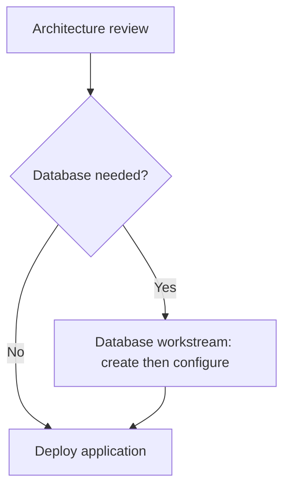

# Data model and invariants

[Documentation home](../README.md)

The executable schemas in [roadmap.ts](../lib/roadmap.ts),
[projects.ts](../lib/projects.ts), and [shared.ts](../lib/shared.ts) are authoritative.
This document explains how those fields work together.

## Entities

| Entity | Main fields | Meaning |
| --- | --- | --- |
| Workspace (version 2) | `activeProjectId`, `engineers`, `teams`, `projects`, `templates` | Local roadmap content |
| Project | `id`, `engineerIds`, `roadmap` | Independent application roadmap and its engineer roster |
| Roadmap (version 1) | `application`, `title`, `tasks` | Project name, roadmap title, and ordered task array |
| Task | `id`, `title`, `parentId`, `dependsOn`, `status`, `owner`, `teamId`, `assigneeIds`, `description`, `criteria` | Work item; task IDs and references are local to a roadmap |
| Decision | Task with `decision: { answer }` (null, yes, or no) | Yes/No question, with no children |
| Conditional task | `condition: { decisionId, answer }` | Work required only for that decision's selected answer |
| Engineer | `id`, `name`, `team` | Assignment identity; `team` is a retained legacy text field |
| Team | `id`, `name`, `engineerIds` | Canonical shared team directory; engineers can be in multiple teams |
| Template | `id`, `name`, `description`, `sourceProjectName`, `roadmap` | Independent workflow snapshot with reset progress and assignments |
| Member | `email`, `role`, `projectIds`, server-only `userId` | Inherited membership metadata; runtime uses one local owner |
| Shared snapshot | `workspace`, `revision`, `updatedAt`, `updatedBy`, `user`, `membership`, `members` | API response; workspace can be null when no projects are visible |

The inherited snapshot/membership shape is retained for compatibility with the
shared domain code. This edition always uses a fixed local owner with all-project
access. There is no membership API or multi-user login. Engineer assignments are
planning records.

## Hierarchy, prerequisites, and order

- `parentId: null` means a top-level step. Any task with children is a workstream.
- Substeps inherit ancestor prerequisites and branch conditions.
- Depending on a workstream waits for its applicable leaf tasks.
- The task array preserves sibling order. **Move up/down** changes that order,
  not `dependsOn`; the dependency map still follows prerequisite relationships.
- Validation rejects missing references, duplicate task IDs, parent/dependency
  cycles, and contradictory inherited conditions.

## Stored versus displayed status

| Stored value | Meaning |
| --- | --- |
| `todo` | Pending work; UI derives ready, blocked by prerequisites, or waiting for a decision |
| `in-progress` | Work has started |
| `done` | Work is complete |
| `skipped` | Explicitly not needed |
| `blocked` | Explicit impediment; requires a nonempty `blockedReason` |

Displayed workstream status is derived from its leaves. It must not be stored as a
manual blocked/skipped group status. The status helpers distribute group actions
to eligible leaves. Decision answers determine their todo/done state.

Inactive decision branches display **Not needed** and resolve dependency checks,
but their saved progress is retained. Unanswered branches display **Waiting for
decision**. Completed and skipped tasks resolve prerequisites; only applicable,
non-skipped leaf tasks contribute to completion totals. Answered decisions count
as completed leaf work. Reopening prerequisites reconciles downstream progress
and may clear a dependent decision's answer.

Use domain helpers (`changeTaskStatus`, `answerDecision`, `deleteStep`, `moveStep`)
instead of assigning statuses directly. `validateRoadmap` calls `reconcile` before
returning the accepted roadmap.

## Decision example

The synthetic [roadmap example](../examples/roadmap.json) can be imported into a
development workspace. Its structure is:

The deployment task depends on both the decision and the database workstream.
When the answer is No, database work is inactive and resolves that prerequisite;
the decision still has to be answered. On Yes, the database leaves must finish.
Other prerequisites on deployment would still apply on either branch.

## Copies, templates, and imports

Creating a project or saving a template generates new task IDs and rewrites all
parent, dependency, and decision references. Both clear statuses to `todo`,
decision answers, impediments, and task assignees. They preserve workflow text,
criteria, responsible team references, and conditions. The new project's roster
comes from the project-creation form. The original project is unchanged.

Templates are snapshots, not live links to their source project. Template names
are unique ignoring case and surrounding whitespace. There is currently no
rename/update/delete template UI; save another name for a revised workflow.
Teams remain shared directory entries: renaming a team updates its displayed name
in both projects and templates.

Imports support a version-1 roadmap, a `pathways-project` export, or a version-2
workspace. They create new project/task IDs, merge/remap teams and engineers, and
preserve imported progress. Workspace imports also add templates; duplicate
template names receive an `(imported N)` suffix. A workspace export includes the
visible content and templates but not internal local-owner metadata. It is not a complete security/identity backup.

## SQLite layout

A single `workspace` row contains `id = 1`, `revision`, and a JSON `state` with
workspace content, local membership, timestamps, and revision. A SQL constraint
keeps the JSON revision consistent with the indexed revision. The whole row is
updated atomically using a revision predicate. Reads see one complete snapshot.
Schema version 2 is recorded with `PRAGMA user_version`. A separate
`application_flows` table stores each definition's `id`, `revision`, `updated_at`,
and JSON `definition`. Each flow has an independent revision. The schema-1 upgrade
adds that table without modifying the workspace row. See
[Application flows](application-flows.md) for the flow schema and invariants.

The database uses WAL journaling and FULL synchronous writes. Its file and any
sidecars live together in the persistent Docker volume. The active project is a
browser preference; canonical saved content uses the first project.

Legacy workspaces without teams derive them from existing task owner labels; the
first write persists all affected project references together. Missing template
arrays/metadata normalize to empty. A pre-template client that omits `templates`
on save preserves the existing library. A client without the decisions feature
header cannot save projects containing decisions. Existing projects, teams, and
templates cannot be removed by simply omitting them from a workspace PUT.

## Current enforced limits

| Item | Limit | Enforced in |
| --- | --- | --- |
| Projects / templates | 100 each | `lib/projects.ts` |
| Tasks per roadmap, including groups and decisions | 120 | `lib/roadmap.ts` |
| Teams / engineers | 500 each | `lib/projects.ts` |
| Engineers per project or task | 50 | Project/task schemas |
| Serialized shared workspace | 1,500,000 bytes | `WorkspaceStore.compareAndSwap` |
| Workspace HTTP request | 2,000,000 bytes | `lib/server-workspace.ts` |

The entire workspace uses one revision and is loaded as a unit before server-side
filtering. For substantially larger teams/data, consider project-level revisions
and paginated loading; increasing only schema limits is not enough. There is no
persisted audit history, soft-delete, or undo facility. Use SQLite or JSON backups for
recovery, and export a draft before resolving a conflict by loading shared data.

Schema 3 adds nullable `projectId` to flow definitions, referencing the same
workspace project IDs as roadmaps. Existing schema-2 definitions remain unchanged
and read as Unassigned. Save operations reject nonexistent project IDs. Moves use
the flow revision, preserve its global ID and graph, and do not edit the roadmap.
Project creation advances the workspace revision; renaming a roadmap project
also renames it in the application-flow selector.
